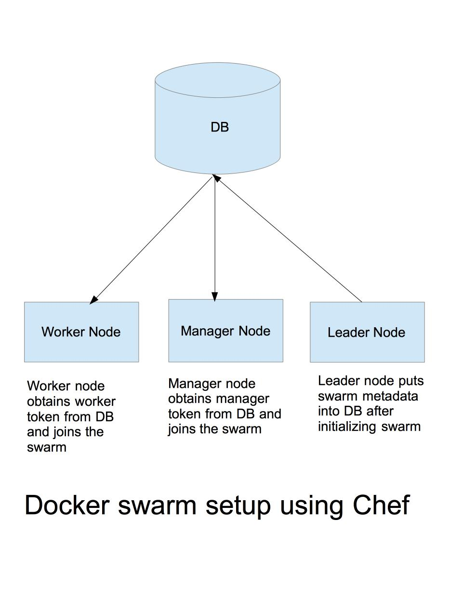

# Docker Swarm On AWS Using Chef

## Synopsis

While there are many ways to initialize and configure a docker swarm on aws infrastructure, this experimental project provides a particular way to configure a docker swarm using Chef recipes. The chef recipes can be provided to opsworks stacks to automate the docker swarm configuration or can be executed manually on individual EC2 instances using chef-solo.

## Architecture

The architecture uses aws dynamo db for storing the swarm related metadata. Docker swarm is initialized on a leader node by running appropriate recipes, the leader node is responsible for storing the swarm metadata into dynamodb.The metadata includes docker swarm join tokens for manager as well as worker nodes and the manager address. The manager node(s) retrieve the metadata from the dynamo db and uses it to join the swarm similarly the worker node(s) retrieve the metadata from db and uses the information to join the swarm. 

The below illustrates the architecture.

The components used in this approach

* **AWS S3**:  S3 service is used to store the packaged cook books which will be used by Opsworks/chef-solo to execute the recipes, alternatively any source code repository such as github can be used.   

* **AWS Dynamo DB**:  A dynamo db table is used to store the information needed to configure the swarm such as join tokens and manager address information.   

* **AWS cli**: AWS cli is used to execute aws dynamo db apis such as putting /getting swarm information.   

* **Chef development kit**:  The ChefDK is used to create and manage cook books.   

* **Berksfile**: The Berksfile which is now part of ChefDK is used to manage dependencies and also package the cookbooks.

## Recipes
* **settings** : The settings recipe is used to initialize settings such as providing a unique name to the swarm. The unique name is used to add the swarm settings into the dynamodb such as *<uniquename>_worker_token* or *<uniauename>_manager_token*. The settings recipe is executed on all the swarm nodes. A settings.json can be passed to the chef which has the unique name information along with other information needed for the recipes.   

* **default** : The default recipe is used to install docker service. The default recipe is executed on all the swarm nodes   

* **swarminit** : The swaminit recipe is used to initialize the swarm on a leader node and the worker and manager tokens are determined. The identified tokens are added into dynamo db.   

* **addtokens** : The addtokens recipe is used to add the manager token, worker token, manager address into the dynamo db. The recipe uses the aws cli commands to put items into the dynamo db.   

* **joinmanager** : The joinmanager recipe is executed on the manager nodes so that the node can be joined into the swarm. The joinmanager retrieves the token and address information from the dynamo db and executes the _docker swarm join_ command to  join the swarm cluster   

* **joinworker** : The joinmanager recipe is executed on the worker nodes so that the node can be joined into the swarm. The joinworker retrieves the token and address information from the dynamo db and executes the _docker swarm join_ command to  join the swarm cluster

##### Recipes to be executed

* On a leader node settings, default, swarminit, addtokens recipes need to be executed.
* On a manager node settings, default, joinmanager recipes need to be executed.
* On a worker node settings, default, joinworker recipes need to be executed.

##### Settings can be passed to recipes using json

	{
	  "swarmname": "TestSwarm",
	  "run_list": [
		  "recipe[dockerchef::settings]",
	       recipe[dockerchef::joinmanager]"
	  ]
	}

## Code examples

##### Initializing Swarm

	swarmInitCommand = "docker swarm init"
	Chef::Log.info("Initializing Swarm")
	shell = Mixlib::ShellOut.new("#{swarmInitCommand}")
	shell.run_command
	Chef::Log.info("Swarm Initialized "+ shell.stdout)

##### Determine the swarm tokens

	swarmManagerToken "docker swarm join-token -q manager"
	Chef::Log.info("Obtaining Swarm Manager Token")
	shell = Mixlib::ShellOut.new("#{swarmManagerToken}")
	shell.run_command
	token = shell.stdout
	// read the token received from docker and store it for subsequent recipes
	node.set['swarm']['managertoken'] = token 
	Chef::Log.info("Obtained Swarm Manager Token : #{token}")
	
##### Add manager, worker tokens and manager address to the db
    
    managerToken = node.set['swarm']['managertoken'] // determined by swarminit recipe
    
    // json template based on the db structure
	putItemTemplate =   "{\"TokenKey\": {\"S\": \"<key>\"},\"TokenCode\":{\"S\": \"<value>\"}}"
	item_hash = JSON.parse(putItemTemplate)
	
	item_hash['TokenKey']['S'] = managerKey 
	item_hash['TokenCode']['S'] = managerToken
	managertokenitem = item_hash.to_json
	
	command = "aws dynamodb put-item --table-name SwarmMetaTable --item '#{managertokenitem}'"
	Chef::Log.info("Putting item")
	shell = Mixlib::ShellOut.new("#{command}")
	shell.run_command

##### Join nodes into the swarm
    // Obtain the token and manager address by getting the item from the dynamo db
     
	swarmJoinCommand = "docker swarm join --token #{token}  #{managerAddr}"
	Chef::Log.info("Worker Joining Swarm with command #{swarmJoinCommand}")
	shell = Mixlib::ShellOut.new("#{swarmJoinCommand}")
	shell.run_command
	Chef::Log.info("Worker Joined Swarm "+ shell.stdout)
	
##### example command to execute recipes
	chef-solo -j <path to json> -r <url to the cookbook tar file>

## Further Enhancements
The cookbook can be further enhanced to support autoscaling of the worker/manager nodes and provide support for TLS for master/worker node communication. To support auto scaling one of the methodologies that could be followed is to put all the manager addresses into the dynamo db and identify the manager which is up and running, this is needed since the original leader node may not be up and running and the swarm might have selected a new leader.

Cookbooks can be provided further configuration parameters such as port numbers, db table names e.t.c

